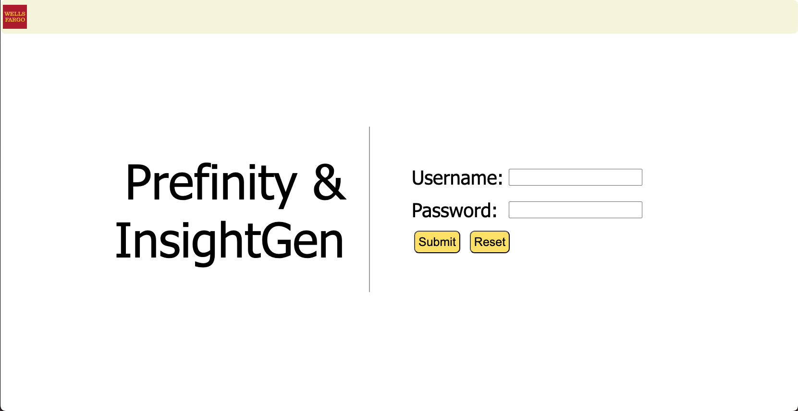
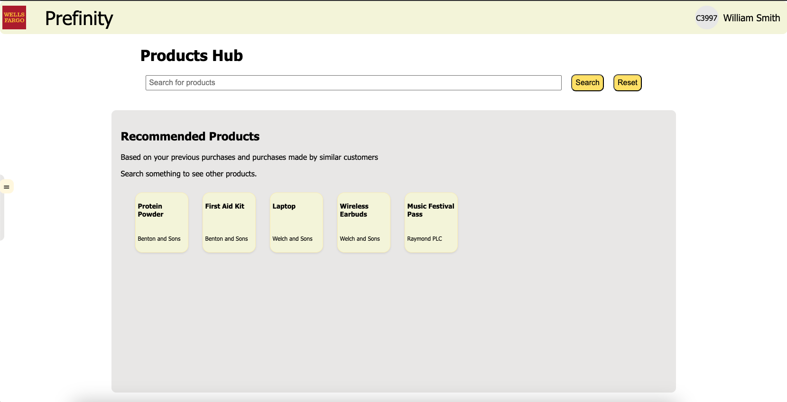
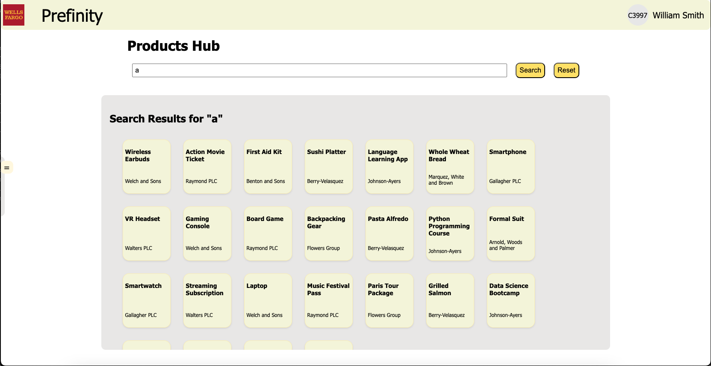
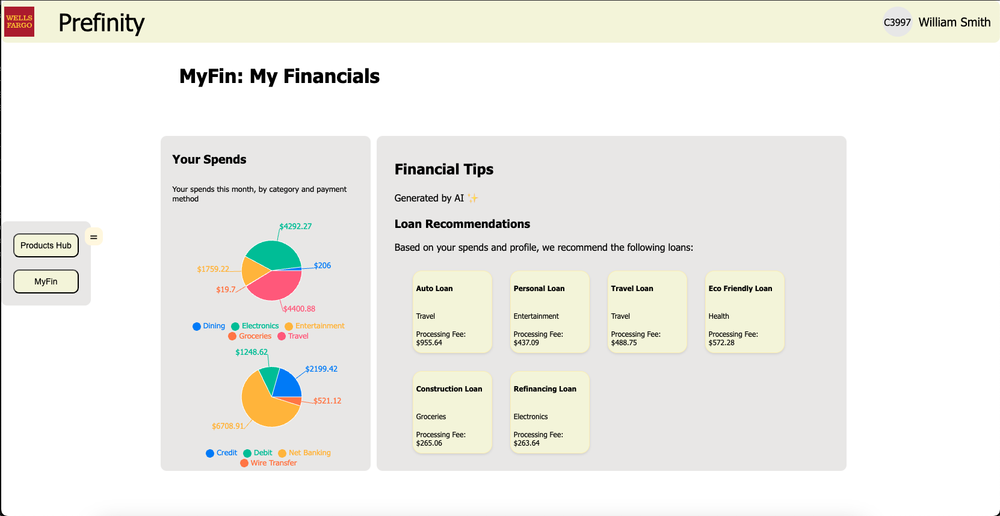
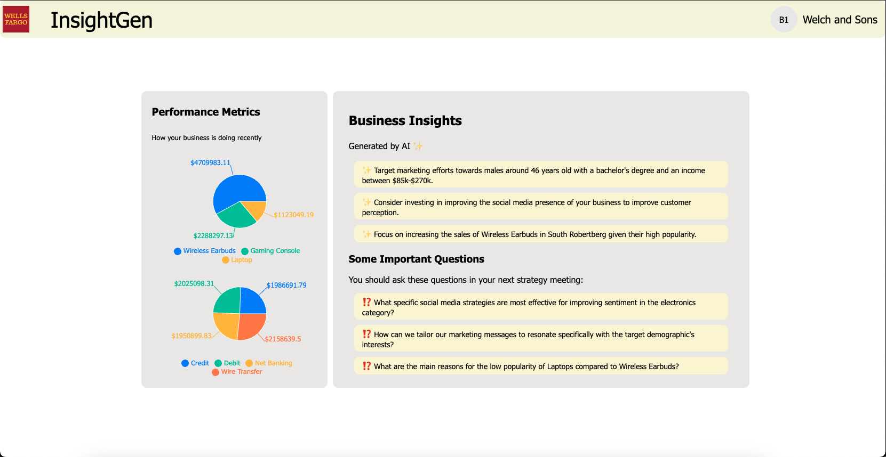

# 🚀 Project Name

## 📌 Table of Contents
- [Introduction](#introduction)
- [Demo](#demo)
- [Inspiration](#inspiration)
- [What It Does](#what-it-does)
- [How We Built It](#how-we-built-it)
- [Challenges We Faced](#challenges-we-faced)
- [How to Run](#how-to-run)
- [Tech Stack](#tech-stack)
- [Team](#team)

---

## 🎯 Introduction
A brief overview of your project and its purpose. Mention which problem statement are your attempting to solve. Keep it concise and engaging.

## 🎥 Demo
📹 [Video Demo](./artifacts/demo/demo_video.mp4) 

🖼️ Screenshots:
Login Page:


Products Hub:


Products Search:


MyFin: Financial Hub:


InsightGen: Business Portal:


## 💡 Inspiration
What inspired you to create this project? Describe the problem you're solving.

## ⚙️ What It Does
Explain the key features and functionalities of your project.

## 🛠️ How We Built It
Briefly outline the technologies, frameworks, and tools used in development.

## 🚧 Challenges We Faced
Describe the major technical or non-technical challenges your team encountered.

## 🏃 How to Run
1. Clone the repository  
   ```sh
   git clone https://github.com/your-repo.git
   ```
2. Install dependencies  
   ```sh
   npm install  # or pip install -r requirements.txt (for Python)
   ```
3. Run the project  
   ```sh
   npm start  # or python app.py
   ```

## 🏗️ Tech Stack
- 🔹 Frontend: React
- 🔹 Backend: FastAPI
- 🔹 Database: SQLite
- 🔹 Other: Google Gemini API

## 👥 Team
- **Sajal Singhal** - [GitHub](https://github.com/SSReal)
- **Md Ubaid Khan** - [GitHub](https://github.com/mdubaidkhan)
- **Swarnabh Paul** - [Github](https://github.com/SwarnabhGHDummy)